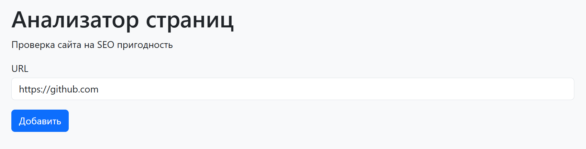
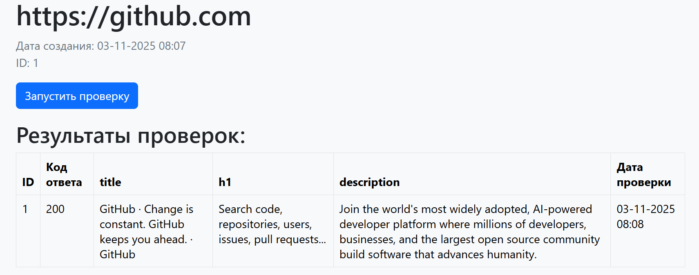
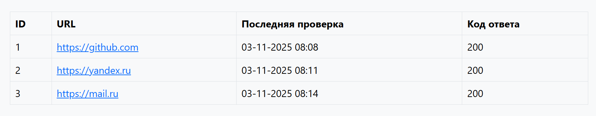

# Page Analyzer

Page Analyzer is a tool for assessing the basic SEO elements of a webpage. It performs the following checks:
* Presence of the <title> tag
* Presence of exactly one <h1> tag
* Presence of a <meta name="description"> tag
* Retrieval of the HTTP status code to determine the page's accessibility

### Page Analyzer on render
https://java-project-72-7dn5.onrender.com

### Technologies
* Java 21
* Gradle
* JUnit 5
* Javalin
* PostgreSQL
* H2 Database
* JTE
* Unirest

## Installation and Running

## Requirements
* Java Development Kit (JDK) 17 or higher
* Gradle

## Usage (Examples)

### Adding new URL

### Checking a Specific URL

### Viewing All Checked URLs

### Hexlet tests and linter status:

### Github actions status:

### Quality Gate Status:

### Coverage:

### Code smell:

### Bugs:

### Duplicated lines:

